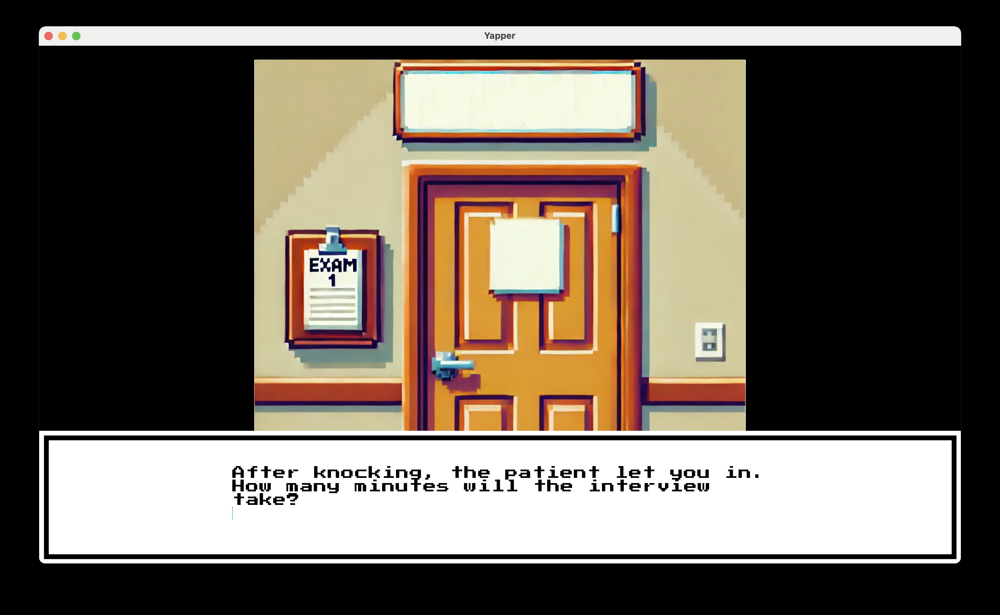
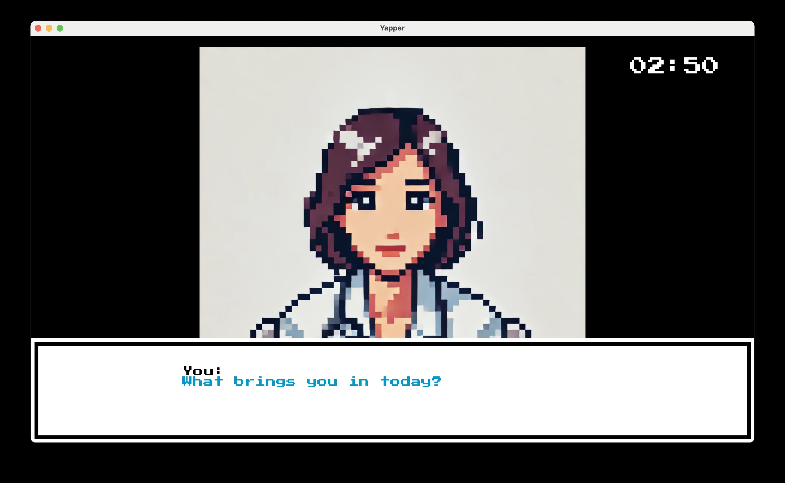
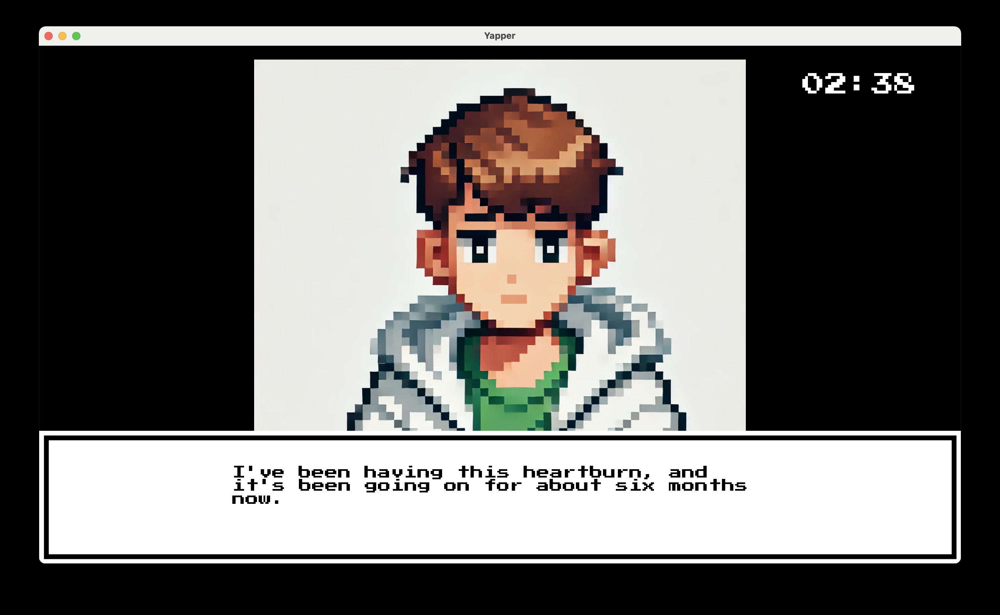

             <h1>Yapper</h1>

This is a repository for the game I have been developing in Python for macOS using the Ren’Py Engine called Yapper. I want it to be a free, fun tool for healthcare students (nursing students, PA students, medical students) to practice patient interviews and medical communication skills in a timed setting. However, if you do not fall into one of those categories or are just generally curious about how clinical encounters work, this tool is for you as well. 

## Design
- [ ] Styled like a 16 bit gameboy advance game to pay homage some of my favorite video games during my childhood years (The Legend of Zelda: The Minish Cap, Pokemon Leaf Green, the Invincible Iron Man)
- [ ] I thought the interractive story format would be fitting to capture the dynamic, back and forth nature of a conversation between a patient and the medical interviewer
- [ ] Each interaction requires the user to set the amount of time they need for the interview. After the countdown timer finishes, the user is asked whether they would like to end or continue the interview
- [ ] The text inputted by the user is fed into a small language model (SLM) that I trained to respond like a patient. (For context, I am able to inference this SLM on my laptop which has an 8th-gen i5 processor and 8gb of RAM. I get somewhere between 112 and 120 tokens per second). 
- [ ] The patient interview follows the following format: https://web.archive.org/web/20240419094912/https://resident360.nejm.org/training-resources/patient-communication/the-medical-interview/core-concepts
    - [ ] The user should be able to ask the patient many about many of the questions/topics listed in the outline

 
 
 

## About the Simulated Patient
- [ ] Alex Morgan is a 34-year-old [male/female] born Born June 15, 1990 who presents with a primary complaint of heartburn that has been ongoing for the past six months. The patient reports that the heartburn started gradually and has become a recurring issue, particularly after meals. Alex describes the sensation as a burning feeling in the chest that typically occurs after eating and is rated as a 7 out of 10 in severity.
    - [ ] Varied the sex of the patient just in case the user needs to ask any questions related to the Simulated patient’s sex
- [ ] The patient notes that episodes of heartburn are often exacerbated by stress and after consuming large meals. Alex occasionally experiences associated symptoms such as nausea and a sour or bitter taste in the mouth. The heartburn usually lasts for about an hour after eating.
- [ ] Alex has not reported any significant medical problems in the past, and the only surgery the patient has undergone was the removal of three wisdom teeth in 2013. Additionally, Alex denies any history of hospitalizations or other medical issues. The patient expresses concern that the heartburn may continue to interfere with daily activities, especially during stressful periods.
    - [ ] Alex Morgan is a graphic designer
- [ ] Alex is also married and met his/her partner in high school

## Setup
- [ ] I do not have an Apple Developer Account. Therefore, you will need to run the included bash script to give small language model permission to inference in terminal (by making the run file executable) and produce the response for the simulated patient. 
    - [ ] Make sure that the bash script ("script.sh") and “interview_game.app” are in the same directory
- [ ] You could also manually provide the permissions by running the following commands
    - [ ] cd /path/to/MyGame.app/Contents/Resources/autorun/game
    - [ ] chmod +x run

## Moving Forward
- [ ] I plan to remove the 100 character limit for user interactions in the game.
- [ ] Release versions of this app for Linux and Windows. (Maybe even develop an Android Version of this app in the future).
- [ ] I would like to add sound-effects to the game 
- [ ] I Would also like to add more avatars for the doctor and patient (allow user to select an avatar for the doctor)
- [ ] I would probably like to make the timer optional (so the user can practice without a time constraint if they need)
- [ ] Eventually, I would like for this program to be able to evaluate the quality of user interactions and give them feedback on how they can improve. 
